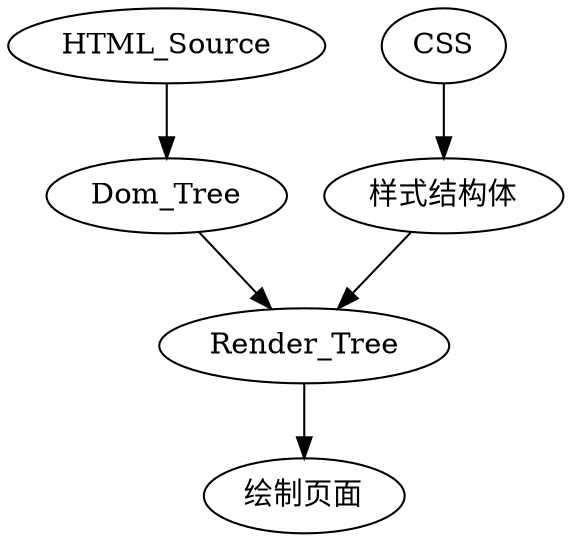

# 页面重绘和回流（也有叫重排，英文：reflow）以及优化

浏览器对页面的呈现的处理流程：



1. 浏览器吧获取到HTML代码解析成DOM树，每个tag都是DOM树中的一个节点，根节点为`document`对象。 DOM树包含所有HTML标签，包括`display:none`隐藏和JS动态添加的元素等；
1. 浏览器把样式解析成样式结构体，同时去掉不能识别的样式；
1. DOM Tree和样式结构体组合成Render Tree, Render Tree类似于样式结构体，但区别很大， Render Tree能识别样式，每个NODE都有自己的style，而且Render Tree不包含隐藏的节点（比如display: none, head节点）， visibility: hidden隐藏的元素会包含到Render Tree,因为会影响布局，占有空间。根据CSS2的标准，Render Tree的每个节点都称为Box（Box dimensions）， 理解页面元素为一个具有padding, margin, border 和 position的盒子；
1. 一旦RenderTree构建完毕后，浏览器就可以根据Render Tree绘制页面；


## 回流与重绘

1. 当Render Tree中的一部分或全部因为元素的规模尺寸，布局，隐藏等改变而需要重新构建，就称为回流（flow）。每个页面至少需要一次回流（页面第一次加载的时候）。在回流的时候，浏览器会使Render Tree中收到影响的部分失效，并重新构造这部分Render Tree, 完成回流后， 浏览器会重新绘制收到影响的部分到屏幕中，该过程成为重绘；

1. 当Render Tree中的一些元素需要更新属性，而这些属性只是影响元素外观，风格，而不会影响布局的， 比如backgroud-color。这就称为重绘（因为不需要回流 ^_^）；

重绘是回流引发的， 所以回流必然重绘， 重绘不一定要回流。

<!-- 
简单来讲，构建Render Tree就叫回流，更新元素外观就称为重绘
 -->

### 回流在何时发生

当页面布局和几何属性改变时就需要回流：

1. 页面渲染初始化
1. 脚本操作DOM
1. 添加或删除可见的DOM元素
1. 增加或移除样式表
1. 操作class属性
1. 激活CSS伪类
1. 元素位置改变
1. 元素尺寸改变--边距、填充、边框、宽度和高度
1. 计算`offsetTop/Left/Width/Height`,`scrollTop/Left/Width/Height`等
1. 改变字体
1. 内容改变--文本改变或者图片大小改变引起的计算值宽度和高度
1. 浏览器窗口尺寸改变--resize事件发生

举个栗子：

```js
var s = document.body.style

s.padding = '2px'; // 回流加重绘
s.border = '1px solid red'; // 再一次回流 + 重绘
s.color = 'blue'; // 再重绘
s.backgroundColor= 'red'; // 再重绘
s.fontSize = '14px'; // 再一次回流 + 重绘
// 添加Node，再一次回流+重绘
document.body.appendChild(document.createTextNode('abc!'));
```

## 优化

1. 浏览器会维护一个队列，把所有会引起回流、重绘的操作放入这个队列，等队列中的操作到了一定的数量或者一定的时间间隔， 浏览器就会flush队列，进行一个批处理，让多次回流变一次回流重绘。
1. 有时候需要强制浏览器提前flush队列，这样优化可能就起不到作用了，以下这些style信息在获取时，浏览器为了给出最精确的值而去flush队列：
    - `offsetTop`,`offsetLeft`,`offsetWidth`,`offsetHeight`
    - `scrollTop/Left/Width/Height`
    - `clientTop/Left/Width/Height`
    - `width`, `height`
    - 请求了`getComputedStyle()`或者IE的`currentStyle`

1. 减少回流/重绘的手段
    1. 避免多级内联样式
        因为每个都会造成回流，样式应合并到外部类，这样仅当改元素的class属性可被操控时仅会产生一个回流
    1. 直接改变className,如果动态样式，直接用cssText(考虑没有优化的浏览器)
        ```js
        // bad 
        var left = 1;
        var top = 1;
        el.style.left = left + 'px';
        el.style.top = top + 'px';

        // good(add class)
        el.className += 'className1';

        // good(css text)
        el.style.cssText += `
        left:${left}px;
        top:${top}px
        `;
        ```
    1. 让要操作的元素进行“离线处理”，处理完以后一起更新
        a) 使用`DocumentFragment`进行缓存操作，引发一次回流和重绘；
        b) 使用`display:none`技术，只引发两次回流和重绘；
        c) 使用`cloneNode(true or false)`和`replaceChild`技术，引发一次回流和重绘
    1. 不要经常访问会引起浏览器flush队列的属性，如果一定要访问，可适当加缓存处理
        ```js
        // bad
        for(...) {
            el.style.left = el.offsetLeft + 5 + 'px';
            el.style.top = el.offsetTop + 5 + 'px';
        }
        // well
        var left = el.offsetLeft, top = el.offsetTop, s = el.style;
        for(...) {
            left += 5;
            top += 5;
            s.left = left + 'px';
            s.top = top + 'px';;
        }
        ```
    1. 让元素脱离动画流， 减少回流的Render Tree的规模
    1. 动画效果应用到position为absolute或fixed的元素上
    absolute和fixed的元素不影响其它元素布局，所以只会导致重新绘制，而不是一个完整回流。
    1. 牺牲平滑度换取速度
        每次1像素移动一个动画，如果动画及随后产生的回流使用了100%的CPU，动画看上去就会是跳动的，因为浏览器正在与更新回流做斗争，所以必要时可以适当牺牲平滑度。
        <!-- 如果高平滑度导致的回流占用大量资源，产生资源竞争，动画看起来会是跳动的， 所以可适当降低平滑度。 -->
    1. 避免使用table布局
        table上一些很小的变化都会导致表格中所有其它节点回流

## 工具

没找到~~