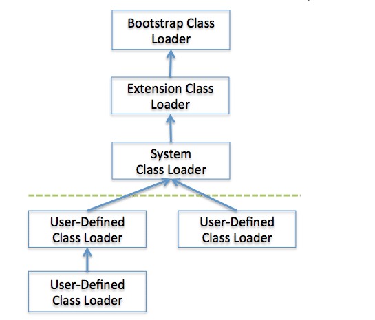

# JVM基本概念

## 基本结构

### ClassLoader(类加载子系统）

#### 作用

装载.class文件

#### 装载方式

classLoader有两种装载class的方式（时机）：

1. 隐式：运行过程中，碰到new方式生成对象时，隐式调用`ClassLoader`到JVM
1. 显式：通过`Class.forName(..)`动态加载

#### 双亲委派模型（Parent Delegation Model）

从虚拟机的角度来说，有两种加载器：

1. 启动类加载器（Bootstrap ClassLoader）
    由C++语言实现，是虚拟机自身的一部分。
1. 所有其它的类加载器。
    Java语言实现，独立于虚拟机外部，全部继承自`java.lang.ClassLoader`

从开发者角度来看，加载器可以细分为：

1. 启动类加载器
    负责将 `%JAVA_HOME%/lib` 下面的类库加载到内存中，开发者无法直接获取到启动类加载器的引用。
1. 标准扩展类加载器
    由 Sun 的 `sum.misc.Launcher$ExtClassLoader`实现，负责将 `%JAVA_HOME/lib/ext%`或者有系统变量 `java.ext.dir` 指定位置中的类库加载到内存中。开发者可以直接使用标准扩展类加载器
1. 应用程序类加载器
    由 Sun 的 `sun.misc.Launcher$AppClassLoader`实现，负责将系统类路径（`CLASSPATH`）中指定的类库加载到内存中。开发者可以直接使用系统类加载器。这个类加载器是`ClassLoader.getSystemClassLoader()`方法的返回值，因此一般称为*系统加载器*
1. 自定义类加载

除了启动类加载器以外，其余的类加载器都应当有自己的*父类加载器*，它们之间的关系被称为类加载器的 **双亲委派模型**。 子类加载器和父类加载器不是以继承的关系来实现，而是通过 **组合(Composition)** 关系来复用父加载器的代码，每个加载器都有都有自己的命名空间（由该加载器以及所有父类加载器所加载的类组成，同一个名称空间不会存在相同完整名称的类，不同名称空间则有可能出现）。

##### 双亲委派模型过程

1. 当前 ClassLoader 首先从已加载的类中查询是否此类已经加载，如果已经加载则直接返回原来已经加载的类。每个 ClassLoader 都有一份自己的加载缓存。
1. 如果当前 ClassLoader 没有从缓存中找到被加载的类的时候，就会委托给父类加载器去加载，而父类加载器会采用相同的策略，一直到 Bootstrap ClassLoader 为止， 如果当前所有的父类加载器都没有加载的时候，再由当前的类加载器加载，并将结果存入缓存中。

##### 这种模型的好处

主要是为了 **安全性** ，可以避免用户自己编写的类动态替换Java的一些核心类， 同时也可以避免 **重复加载**。另外这种模型具备一种 **带有优先级的层次关系**。例如 `java.lang.Object`, 它存在于 rt.jar 中，无论哪一个类加载器都要去加载这个类，最终都是委派给处于最顶端的 Bootstrap ClassLoader 去进行加载，这样可以避免同时出现多个不同的Object类。

### 方法区

### Java堆

### Java栈

### PC寄存

### 内存

### 本地方法栈

### 垃圾回收系统

### 执行引擎
