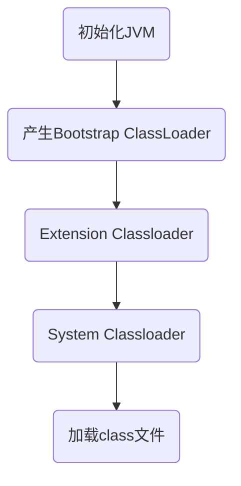

# 热部署

## 原理

### 热部署和热加载

#### 热部署和热加载联系

- 都不重启服务器/编译项目
- 基于Java的类加载器实现

#### 热部署和热加载区别

1. 部署方式：
    - 热部署在服务器运行时重新部署项目
    - 热加载在运行时重新加载Class

1. 实现原理：
    - 热部署直接重新加载整个应用
    - 热加载在运行时重新加载class

1. 使用场景：
    - 热部署更多在生产环境使用
    - 热加载更多在开发环境使用

1. 坏处
    - 热加载直接修改字节码，难以监控。

### 热部署原理解析

Java类加载过程：

类加载五个阶段：

