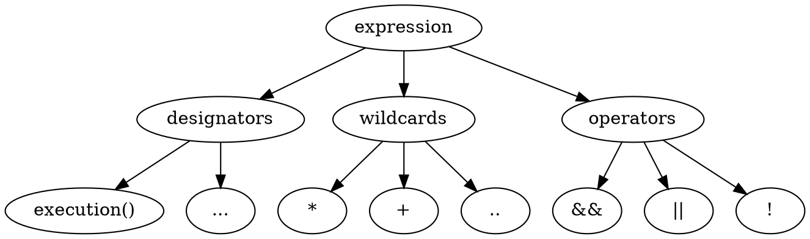

# 面向切面编程范式

## 了解

### 是什么

1. 一种编程范式
1. 解决特定问题
1. OOP的补充

### 初衷

1. DRY原则，解决代码重复性问题
1. SoC: 关注点分离
    1. 水平分离：展示层->服务层->持久层；
    1. 垂直分离：模块划分（订单、库存）；
    1. 切面分离：分离功能性需求和非功能性需求；

### 好处

1. 切面分离后好管理，可以集中处理某一关注点/横切逻辑。
1. 方便添加/删除关注点
1. 侵入性少，增强代码可读性以及维护性

### 应用场景

大多为非功能性需求：

- 权限控制
- 缓存控制
- 事物控制
- 审计日志
- 性能监控
- 分布式追踪
- 异常处理

### 支持AOP的编程语言

JAVA, .NET, C/C++, Ruby, Python, PHP ...

## 案例

## Spring AOP

### 切面表达式



#### wildcards（通配符）

- \* 匹配任意数量的字符
- \+ 匹配指定类以及子类
- .. 用于匹配任意数的子包或参数

#### operators（运算符）

- && 与操作符
- || 或操作符
- ! 非操作符

#### designators（指示器）

- 匹配方法
    + `execution()` 执行流，使用通配符筛选方法
- 匹配注解
    + `@target()`
    + `@args()`
    + `@within()`
    + `@annotation()`
- 匹配包/类型
    + `within()`
- 匹配对象
    + `this()`
    + `bean()`
    + `target()`
- 匹配参数
    - `args()`

### 表达式用法

#### within表达式

作用： 匹配包/类型

```java
// 匹配ProductService类里头的所有方法
@Pointcut("within(com.vgerbot.springaop.service.ProductService)")
public void matchType(){}
// 匹配com.vgerbot.springaop包以及子包下所有类的方法
@Pointcut("within(com.vgerbot.springaop..*)");
public void matchPackage(){}
```

#### 对象匹配

```java
// 匹配AOP对象的目标对象为指定类型的方法， this可以拦截到动态生成的方法（关键字：Introduction）
@Pointcut("this(com.vgerbot.springaop.service.ProductService)")
public void thisDemo(){}
// 匹配实现IProductService接口的目标对象的方法
@Pointcut("target(com.vgerbot.springaop.service.IProductService)")
public void targetDemo(){}
// 匹配所有以Service结尾的bean里头的方法
@Pointcut("bean(*Service)")
public void beanDemo(){}
```

#### 参数匹配

可以通过 execution 或者 args 匹配, execution 可以匹配方法名称、返回类型和修饰符==。args 只匹配参数

```java
// 匹配任何以find开头而且只有一个Long参数的方法
@Pointcut("execution(* *..find*(Long))")
public void argsDemo1(){}
//匹配任何只有一个Long参数的方法
@Pointcut("args(Long)")
public void argsDemo2(){}
// 匹配任何以find开头而且第一个参数为Long型的方法
@Pointcut("execution(* *..find*(Long,..))");
public void argsDemo3(){}
// 匹配第一个参数为Long型的方法
@Pointcut("args(Long,..)")
public void argsDemo4(){}
```

#### 匹配注解

三个匹配级别： 方法、类、参数

```java
// 匹配方法标注有AdminOnly的注解的方法
@Pointcut("@annotation(com.vgerbot.springaop.security.AdminOnly)")
public void annoDemo1(){}
// 匹配标注有Beta的类底下的方法，要求annotation的RetentionPolicy级别为CLASS
@Pointcut("@within(com.vgerbot.springaop.annotations.Beta)")
public void annoWithinDemo(){}
// 匹配标注有Repository的类底下的方法，要求annotation的RetentionPolicy为RUNTIME
@Pointcut("@target(org.springframework.stereotype.Repository)")
public void annoTargetDemo(){}
// 匹配传入的参数类标注有Repository注解的方法
@Pointcut("@args(org.springframework.stereotype.Repository)")
public void annoArgsDemo(){}
```

#### execution表达式

格式

```java
execution(
    modifier-pattern?
    ret-type-pattern
    declaring-type-pattern?
    name-pattern(param-pattern)
    throws-pattern?
)
```

```java
// 匹配com.vgerbot.springaop.service包下Service结尾的类
// 任意参数，
// 任意返回类型
// public方法
@Pointcut("execution(public * com.vgerbot.springaop.service.*Service.*(..))")
public void matchCondition(){}
// 匹配com.vgerbot.springaop.service包下Service结尾的类
// 任意参数，
// 任意返回类型
// public方法
// 参数为Long类型的
@Pointcut("execution(public * com.vgerbot.springaop.service.*Service.*(Long,..))")
public void matchCondition(){}
// 匹配com.vgerbot.springaop.service包下Service结尾的类
// 任意参数，
// 任意返回类型
// public方法
// 抛出RuntimeException的方法
@Pointcut("execution(public * com.vgerbot.springaop.service.*Service.*() throws java.lang.RuntimeException)");
public void matchThrows(){}
```

### Advice注解

用于描述执行时机

1. @Before 方法执行之前
1. @After 方法执行之后
1. @AfterReturning 方法执行之后且有返回值
1. @AfterThrowing 方法抛出异常之后
1. @Arount // 包括所有， 需注入ProceedingJoinPoint参数

#### @After演示

```java
@Before("matchCondition() && args(productId)")
public void before(Long productId){
    // validation arguments here
}
@After("matchCondition()")
public void after(){

}
@AfterThroing("matchCondition()")
public void afterThrow(){

}
@AfterReturning(value="matchCondition()", returning="result")
public void afterReturn(Object result) {
    //
}

@Around("matchCondition()")
public Object around(ProceedingJoinPoint jp){
    try{
        return jp.proceed(jp.getArgs());
    } catch(Exception e) {
        return null;
    } finally {
        // after
    }
}

```