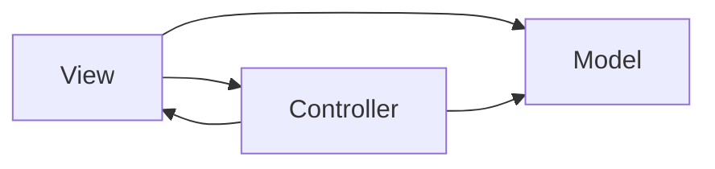

# MVC, MVP, MVVM

## Godfrey Nolan 演讲笔记

### MVC

#### 什么样才是MVC



```sequence
User --> View: User Gesture
View-->Controller: Invoke Action
Controller-->Model: Execute Requested Task
Model-->View: Notify Changes
View-->Model: Ask for Changes
Model-->View: Updated Model
View --> View: refresh
```


#### MVC的优缺点

##### 优点

- No Business logic in UI
- Easier to unit test

##### 缺点

- Doesn't scale, separates UI but not model
- Controller often grows too big
- Violates Single Responsibility, Interface Segregation SOLID principles